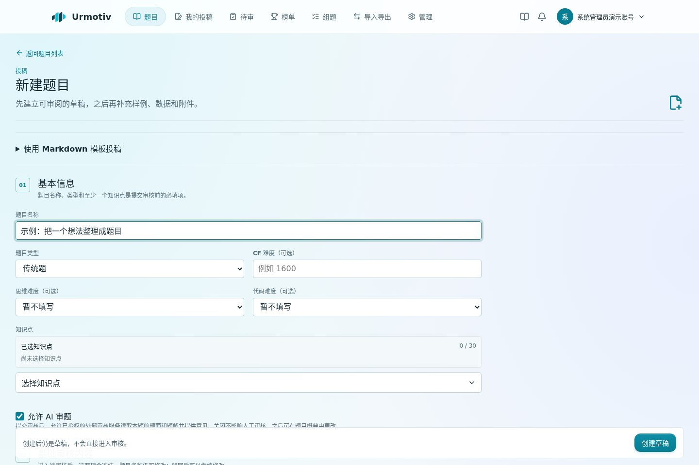
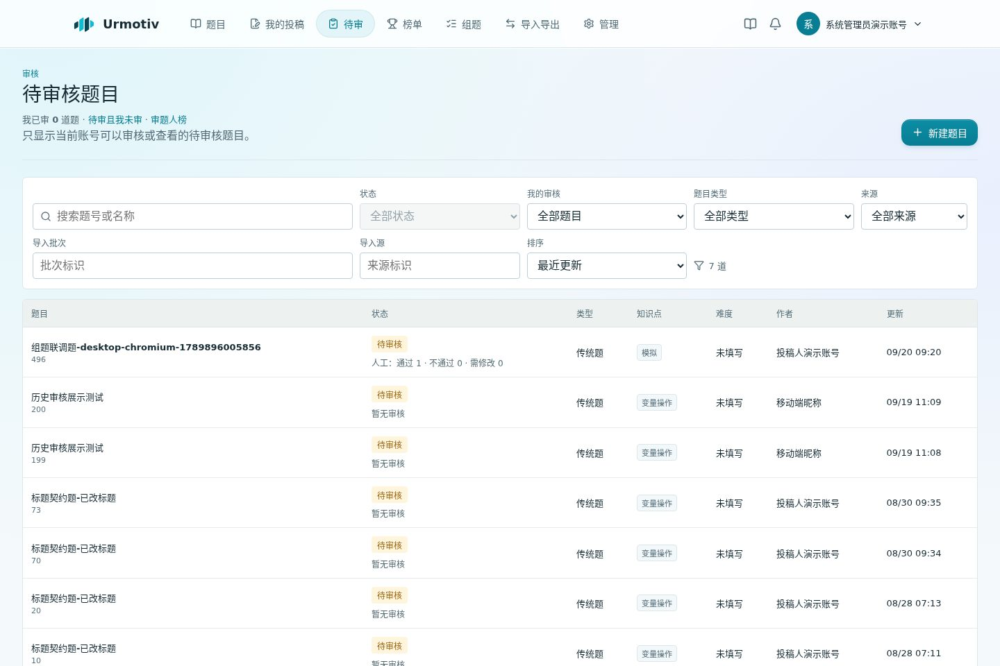

# 审题统计、通知和快速建题

## 投稿人

编辑已有题目时，停顿 1.2 秒后保存；连续编辑每 15 秒保存。中文输入法组词期间暂停提交。右上角显示保存状态，失败或修订冲突后停止自动重试，避免覆盖他人的版本。离开仍有未保存内容的页面时浏览器提醒。

个人资料中的「邮件通知」可以分别开关新审核意见、审核通过、审核不通过，默认全部开启。只发给已验证的主要联系邮箱；邮件不含题面、题解、内部备注或模型原文。修改同一条意见不重复发新意见通知。状态以点进站内后的当前记录为准。

## 审题人

题目列表统一显示当前轮次人工通过、不通过、需修改数量，以及 AI 意见数量。这是意见汇总，不是默认规则的有效票数；撤权、明确拒绝或不计机器人时，最终规则仍独立判断。无意见显示暂无审核。

「待审且本轮我未审」只筛选当前轮次；重新送审的题目会重新进入。累计已审数量和公开审题人榜按题目去重，编辑意见、多轮审核不会重复增加题数。

结果一致率比较当前已定案轮次的明确通过/不通过意见与最终状态。待审、需修改、旧轮次、机器人、已删除题目和停用账号不进入一致率分母；展示一致数/可比较数，无样本显示横线。同率时优先样本较多者。这不是独立准确率测评。

## AI 快速建题插件

管理员在插件页启用「AI 快速建题」，配置 OpenAI 兼容基础地址、模型名称、深度思考开关和 API 密钥。服务端追加 `/chat/completions`。模型配置独立保存，可使用与 Fermata 相同的提供方；不要填入 Fermata 管理令牌或机器人令牌。

投稿人粘贴最多 20 万字符/一万行材料，模型只返回原文行号区间，服务器据此提取正文。预览中选择知识点，点击「确认并创建草稿」即可；也可先填入表单继续编辑。标程和无法分类的原文放在正式题解中，避免将解法误放到题面。不要把提取结果未经检查直接送审；范围选择仍可能有误。

任务通过 `/api/v1/ai-drafts` 创建，再按返回的任务编号读取状态。仅拥有 `problem.create` 权限的真人账号可用，每人最多一个运行任务、进程最多四个。结果仅本人可读，完成后保留 30 分钟，重启不保留。原文不写日志或永久任务库；页面刷新前请自行保留原材料。

流式调用等待模型服务正常结束，以首段输出和中途无输出分别超时；不使用 120 秒总时限、不设置模型输出 token 截断。仅对首次请求的 429/502/503/504 做一次延迟重试；生成中断或格式错误不创建题目，也不自动重复付费生成。

## 运维

迁移 `0032_review_email_notifications` 添加个人偏好与邮件事件队列。新人工/机器人审核、通过/拒绝状态变化与业务事务一同写队列；历史数据不补发。

API 每 30 秒尝试小批投递，发送前重新读取账号状态、题目所有权/可见性、验证邮箱和个人偏好。SMTP 失败重试，最多五次，之后记录失败；不回滚审核。已处理事件保留 30 天。SMTP 的投递确认不是严格恰好一次：进程在 SMTP 接受后、更新队列前崩溃，可能重复投递，稳定 Message-ID 用于辅助去重。

站点 SMTP 配置仍是统一入口，不另设插件 SMTP。数据库内队列只含事件标识和题号，没有收件地址和审核正文。禁用账号、失去题目访问权、未验证邮箱或关闭相应偏好时跳过邮件。
